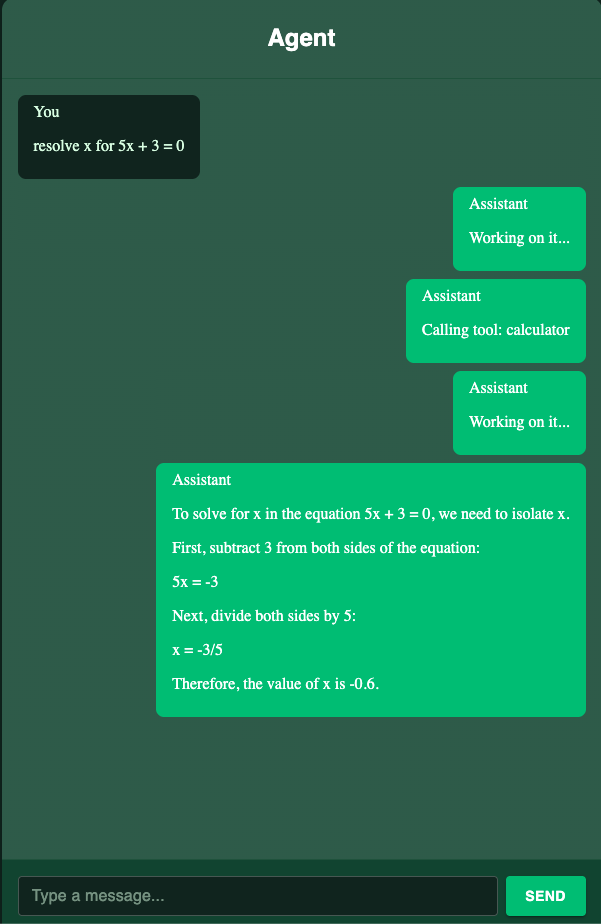

# koog-ktor-websockets-agent

This project was created using the [Ktor Project Generator](https://start.ktor.io).

Here are some useful links to get you started:

- [Ktor Documentation](https://ktor.io/docs/home.html)
- [Ktor GitHub page](https://github.com/ktorio/ktor)
- The [Ktor Slack chat](https://app.slack.com/client/T09229ZC6/C0A974TJ9). You'll need
  to [request an invite](https://surveys.jetbrains.com/s3/kotlin-slack-sign-up) to join.

## Features

Here's a list of features included in this project:

| Name                                                  | Description                                                          |
|-------------------------------------------------------|----------------------------------------------------------------------|
| [Routing](https://start.ktor.io/p/routing)            | Provides a structured routing DSL                                    |
| [WebSockets](https://start.ktor.io/p/ktor-websockets) | Adds WebSocket protocol support for bidirectional client connections |
| [Koog](https://start.ktor.io/p/koog)                  | Integrate LLMs and build AI Agents with Koog framework               |

## Building & Running

To build or run the project, use one of the following tasks:

| Task                          | Description                                                          |
|-------------------------------|----------------------------------------------------------------------|
| `./gradlew test`              | Run the tests                                                        |
| `./gradlew build`             | Build everything                                                     |
| `buildFatJar`                 | Build an executable JAR of the server with all dependencies included |
| `buildImage`                  | Build the docker image to use with the fat JAR                       |
| `publishImageToLocalRegistry` | Publish the docker image locally                                     |
| `run`                         | Run the server                                                       |
| `runDocker`                   | Run using the local docker image                                     |

If the server starts successfully, you'll see the following output:

```
2024-12-04 14:32:45.584 [main] INFO  Application - Application started in 0.303 seconds.
2024-12-04 14:32:45.682 [main] INFO  Application - Responding at http://0.0.0.0:8080
```

## Client (React App)

This project includes a React frontend located in the `/client` folder. It communicates with the Ktor backend via WebSockets.

### Setup & Run
1. Install dependencies:
   ```sh
   cd client
   npm install
   ```
2. Start the development server:
   ```sh
   npm run dev
   ```
   The app will be available at [http://localhost:5173](http://localhost:5173) by default.



## Ollama Integration

Ollama is an open-source tool for running LLMs locally. To use it with this project:

### Install Ollama
- Visit [Ollama's website](https://ollama.com/download) and follow the instructions for your OS.

### Run Ollama in Serve Mode
1. Start Ollama in serve mode:
   ```sh
   ollama serve
   ```
   This will start the Ollama server, making models available for local inference.
2. You can now interact with Ollama from your backend or other tools.
